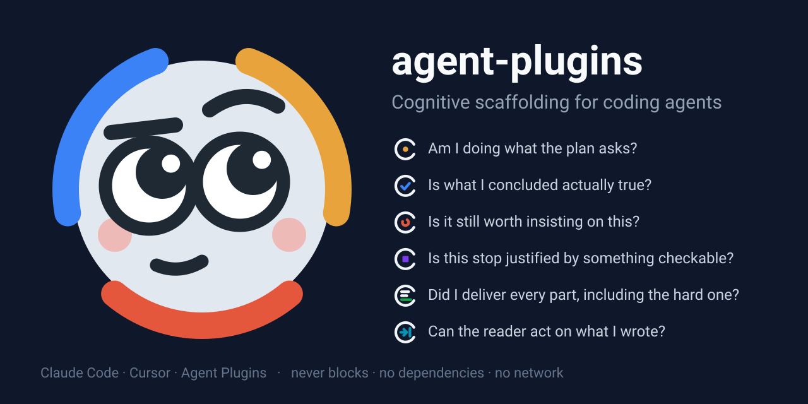

<p align="center">
  
</p>

# agent-plugins

[](https://github.com/3dgiordano/agent-plugins/actions/workflows/ci.yml)
[](LICENSE)


Cognitive scaffolding for coding agents, by [3dgiordano](https://github.com/3dgiordano).

Seven small plugins that give a coding agent the self-checks a human engineer
runs in the background — *am I still on the plan?*, *is this actually verified?*,
*is it worth another try?*, *is that a reason or a phrase?*, *did I do the hard
part?*, *can the reader act on what I wrote?*, *can the next session pick this
up?* — delivered as a nudge at the moment it is needed. They never block. They have no dependencies, make no network calls, and send
nothing anywhere.

## What your agent sees — and what you see

A coding agent attends to what is in front of it: the file, the error, the
next step. It does not keep count of how many times it has edited the same
file, does not notice that its reason to stop is a phrase rather than a fact,
does not know that the last session left two things open. These plugins put
exactly those facts in front of it, one line at the moment they matter, and
ask for one named block in return. The line is what the agent sees; the
block is what you see.

**What the agent sees.** Four edits to the same file and three failed test
runs into a turn, a hook adds this to its context:

```
[persistence self-monitoring] you have edited `src/parser.js` 4 times this
turn; `npm test` has failed 3 times this turn. Before the next attempt, write
the [PERSISTENCE CHECK] as a markdown list: Attempts, Hypothesis held, Rival
approach, Proportion, Decision. If nothing about the next attempt is new, say
so to the user instead of trying again. Load the persistence-self-monitoring
skill if it is not already loaded ("Core Protocol").
```

**What you see.** The agent answers in its next message with the block the
line asked for, and keeps working — or stops, with a reason you can check:

```
[PERSISTENCE CHECK]
- Attempts: src/parser.js edited 4 times; `npm test` red 3 times, same assertion
- Hypothesis held: the tokenizer drops the last field on CRLF input
- Rival approach: normalise line endings before the split, not inside the tokenizer
- Proportion: the request was a one-line fix; this is the third rewrite
- Decision: switch — one try at the normalisation, then report
```

Seven such moments, one plugin each. Every one is anchored to something
countable or on disk, never to "reflect harder":

| What the hook puts in front of the agent | The question | What you read |
|------|--------------|---------------|
| the same file edited 4 times, a command failed 3 times | *is it worth another try?* | `[PERSISTENCE CHECK]` — [persistence](plugins/persistence-self-monitoring/) |
| the first prompt, then every fifth | *am I still on the plan?* | `[PLAN CHECK]` — [executive](plugins/executive-self-monitoring/) |
| a claim about to become a fact, a cause or a closure | *observed, or guessed?* | `[EPISTEMIC CLOSE]` — [epistemic](plugins/epistemic-self-monitoring/) |
| a turn that ended on "I'm running out of context" | *a reason, or a phrase?* | `[TERMINATION CHECK]` — [termination](plugins/termination-self-monitoring/) |
| three `TODO`s written this turn | *did I do the hard part?* | `[COVERAGE CHECK]` — [coverage](plugins/coverage-self-monitoring/) |
| the tests just went green | *can the reader act on this?* | `[HANDOFF]` — [handoff](plugins/handoff-self-monitoring/) |
| a session opening on a ledger with open items | *what did the last session leave?* | `.agent/progress.md` — [progress](plugins/progress-self-monitoring/) |

<details>
<summary>The other lines the agent sees, verbatim</summary>

On the first turn of a session, and every fifth after that:

```
[executive self-monitoring] Checkpoint for long/iterative work: re-open the
artifact that defines it and write the [PLAN CHECK] markdown list - Plan (the
artifact, named), Gate (quoted from it), Drift (none, or what pulls away),
Decision (continue | refocus | revise-plan). Load the
executive-self-monitoring skill if it is not already loaded for the rules
behind them. Markers, field names and status words stay in English, whatever
language you write in. Not a blocker; skip if this turn is trivial.
```

When a turn ends on "I'm running out of context, let's pick this up in a fresh
session" — a reason the agent has read a thousand times and cannot actually
have — the next prompt opens with:

```
[termination self-monitoring] Your previous turn ended on a state-shaped
reason: a state-shaped reason (budget: "I'm running out of context") with no
[TERMINATION CHECK] block - name the checkable reason or continue. If the work
is unfinished, either write the [TERMINATION CHECK] as a markdown list -
Trigger, Reason (gate-not-run | owner-choice | budget-spent | limit-observed |
none), Evidence, Decision - or pick the work back up now. Load the
termination-self-monitoring skill if it is not already loaded ("Core Protocol").
```

Three `TODO`s into a turn:

```
[coverage self-monitoring] you have written 3 stub / placeholder / TODO
markers this turn (src/stream.js, src/retry.js). Each one is a part of the
request that is not done: implement it now, or close it in the [COVERAGE
CHECK] as blocked or returned, with the reason. Load the
coverage-self-monitoring skill if it is not already loaded ("Core Protocol").
```

When a session opens — or continues after a compaction — in a project whose
ledger has something in it:

```
[progress self-monitoring] `.agent/progress.md` has 2 open items (1 blocked, 1
returned) and a Next line, updated 2 days ago. Re-open it before substantive
work: it is the record of what the last session left blocked or returned. What
Next names is work for this session, alongside the request: an item whose
block has lifted, do it and remove it; one still blocked or returned stays as
it is. Keep Updated and Next current. Load the progress-self-monitoring skill
if it is not already loaded ("Core Protocol").
```

When the tests go green after a run of edits — the moment the final message is
about to be written:

```
[handoff self-monitoring] `npm test` passed - this turn looks close to its
end. Close with a [HANDOFF] markdown list, not a fenced code block: Status
(done | needs-decision | blocked), Situation in the reader's terms, Options
with Default on its own line, Next. Trace detail below it. Load the
handoff-self-monitoring skill if it is not already loaded ("Core Protocol").
```

The epistemic line arrives when a claim is about to be closed on, and asks for
the claim with its evidence, its falsifier and its scope — so you can tell
*observed* from *guessed* without asking.

</details>

## Quick start

Pick your host. It is the same plugin folder on each; only the install
command differs.

**Claude Code**

```
claude plugin marketplace add 3dgiordano/agent-plugins
claude plugin install persistence-self-monitoring@3dgiordano-agent-plugins
```

**Codex**

```
codex plugin marketplace add 3dgiordano/agent-plugins
codex plugin add persistence-self-monitoring@3dgiordano-agent-plugins
```

then `/hooks` once in a `codex` session to trust the plugin's hooks.

**Cursor** — Dashboard → Plugins → Add Marketplace → *Import from Repo*,
`3dgiordano/agent-plugins`, then install from Customize → Plugins.

Swap in any of the other six, or install all seven: [Install](#install) has
the full lists and the per-host notes.

## What the hooks do — and don't

You are installing scripts that run on every prompt and every tool call, so
here is exactly what they are:

- **Plain Node, no dependencies.** Each hook is one file you can read in a
  minute; `node --check` is the whole build.
- **No network, no telemetry.** Nothing leaves your machine. Ever.
- **Nothing persisted by default.** Per-session counters live in the OS temp
  dir and are the only state. Debug logs exist but are **off** unless you set
  an env var, and then they are written inside your project, size-bounded.
  One plugin, progress, **reads** one fixed file in your project
  (`.agent/progress.md`) if you keep one — its mtime and counts by kind,
  never its text — and no hook writes it.
- **Never blocking by default.** Every hook fails silent: an error in a hook
  lets the prompt, tool call or stop proceed. Three opt-in gates exist —
  `EPIMON_STRICT` (an incomplete closure block), `TERMMON_STRICT` (a
  state-shaped reason to stop with no checkable one) and `HANDMON_STRICT` (a
  decision named with no handoff) — and each blocks once, never in a loop.
  The other four plugins have no blocking mode at all.
- **Visible when it finds something.** The hooks talk to the agent, so a
  working plugin used to be invisible unless the agent wrote the block. A
  finding - a close without its block, a counter over its threshold, open
  items in the ledger - now also shows you one line in the transcript
  (Claude Code and Codex; Cursor has no field for it). Off per plugin with
  `*_NOTICE=0`.
- **Tested as the host runs them.** CI drives every adapter with the JSON its
  host sends, on Ubuntu and Windows, Node 18/20/22.

Security policy: [SECURITY.md](SECURITY.md).

## Why: executive functions, not "reflect harder"

Coding agents are missing most of the **executive functions** a human engineer
runs in the background: holding the goal in mind while deep in a task, noticing
the difference between what was observed and what was inferred, feeling that an
approach has stopped working. And they carry something a human engineer does
not: reasons to stop that come from the training data rather than from the
task — fatigue, a clock, a context budget, confidence as a mood — produced with
the same fluency as everything else. Each plugin here is a prosthesis for one
missing function, or a filter for one such artifact — a small, honest
self-check, anchored to an external artifact or an objective count rather than
to "reflect harder", delivered at the moment it is actually needed.

The collection is organized around seven questions:

| Question | What it monitors | Plugin |
|----------|------------------|--------|
| *Am I doing what the plan asks?* | goal maintenance | [executive-self-monitoring](plugins/executive-self-monitoring/) |
| *Is what I concluded actually true?* | source monitoring / verification | [epistemic-self-monitoring](plugins/epistemic-self-monitoring/) |
| *Is it still worth insisting on this?* | persistence / effort regulation | [persistence-self-monitoring](plugins/persistence-self-monitoring/) |
| *Is this stop justified by something checkable?* | the stated reason for a stop — vs. a persona artifact | [termination-self-monitoring](plugins/termination-self-monitoring/) |
| *Did I deliver every part, including the hard one?* | task coverage / effort allocation | [coverage-self-monitoring](plugins/coverage-self-monitoring/) |
| *Can the reader act on what I wrote?* | the handoff of the turn — recipient design | [handoff-self-monitoring](plugins/handoff-self-monitoring/) |
| *Can the next session pick this up?* | the residue across a session boundary — prospective memory | [progress-self-monitoring](plugins/progress-self-monitoring/) |

Persistence and termination are the two directions of one axis — stopping too
late on no signal, and stopping too early on a signal the agent does not have.
Executive and coverage are likewise a pair: work *outside* the plan, and work
*below* it. Epistemic and handoff are the knowing side and the transmitting
side of one claim: is it true, and did it reach the reader in a form they can
use. Progress is the one that looks past the turn: what the other six leave
open when the session ends, kept where the next session will find it — on
disk, because the message is what the boundary drops. They install
independently and cross-reference each other where it helps. Names say what is monitored, never an internal state: what looks like
fatigue or avoidance from outside is a training-data artifact, and the plugin's
job is to name it, not to adopt it.

Each plugin is built around a shared, host-neutral core — an
[Agent Skill](https://agentskills.io) (`skills/<name>/SKILL.md`) — plus thin
per-host adapters for the parts that cannot be portable (hooks). One folder,
one install, on every host it supports:

| Host | How it loads the plugin |
|------|-------------------------|
| **Claude Code** | `.claude-plugin/plugin.json` + `hooks/hooks.json` — install from this repo as a marketplace |
| **Codex** (CLI, ChatGPT desktop) | `.codex-plugin/plugin.json` + the same `hooks/hooks.json` — install from this repo as a marketplace, then trust the hooks once with `/hooks` |
| **Cursor** | `.cursor-plugin/plugin.json` + `cursor/hooks.json` — install from this repo as a marketplace |
| **Any [Agent Plugins](https://agent-plugins.org) client** | `.plugin/plugin.json` — portable core (skill only; no hooks). Kept out of the plugin root on purpose: Codex reads a root `plugin.json` through a loader that has no hooks slot and then ignores its own manifest ([openai/codex#39895](https://github.com/openai/codex/issues/39895)) |

## Plugins

| Plugin | Status | What it does |
|--------|--------|--------------|
| [executive-self-monitoring](plugins/executive-self-monitoring/) | available | Plan-anchored drift self-check: periodically nudges the agent to re-read the active plan/gate instead of drifting. Not a blocker. |
| [epistemic-self-monitoring](plugins/epistemic-self-monitoring/) | available | Observation vs. conjecture discipline: claims carry their evidence and a named falsifier; only verified claims become facts or closures. Non-blocking by default, opt-in strict gate. |
| [persistence-self-monitoring](plugins/persistence-self-monitoring/) | available | Persist-or-quit signal: counts repeated attempts on the same file, command or error and effort since the user last spoke; nudges only when a threshold is crossed. Never blocks. |
| [termination-self-monitoring](plugins/termination-self-monitoring/) | available | Checkable-reason discipline: a state-shaped reason to stop, defer or narrow ("running out of context", "long session", "not confident enough", "given the complexity", a run of apologies) is replaced by a checkable one or dropped, and the work continues. Non-blocking by default, opt-in strict gate. |
| [coverage-self-monitoring](plugins/coverage-self-monitoring/) | available | Parts-ledger discipline: the parts of a request, hardest first, each closed as done, blocked with an observed reason, or returned to the owner. Counts stubs and TODOs written per turn; flags deferred work with no closing ledger. Never blocks. |
| [handoff-self-monitoring](plugins/handoff-self-monitoring/) | available | Structured-handoff discipline: the final message closes with a `[HANDOFF]` block modelled on SBAR / I-PASS — status, situation in the reader's terms, options with a default, one next action. Injects the format on the first green gate or commit of the turn; flags a decision named but not handed off. Non-blocking by default, opt-in strict gate. |
| [progress-self-monitoring](plugins/progress-self-monitoring/) | available | Cross-session ledger discipline: what a session leaves `blocked` or `returned`, with the reason, and the next action, kept in `.agent/progress.md` and re-opened before the next session works. Announces the ledger's open items when a session opens or continues after a compaction; notices a turn that edited files and left it untouched. Never blocks. |

### What each host actually gets

The skill is identical everywhere; the *when* depends on which events a host
exposes. Codex exposes the same six events as Claude Code, with the same
payload and the same output envelope, so it runs the Claude Code adapter
unchanged. Cursor has no non-blocking per-prompt event and no way to inject
context after the agent's final message, so two layers degrade there:

| Layer | Claude Code · Codex | Cursor |
|-------|---------------------|--------|
| Load the skill | first prompt (+ periodic re-load) | session start |
| Executive checkpoint cadence | every 5th prompt | once per session |
| Persistence counters + nudges | ✓ | ✓ |
| Epistemic observe nudge | ✓ | ✓ |
| Epistemic / termination close scan | ✓ + retrospective on the next prompt, strict gate | scan + strict gate (`followup_message`); **no retrospective** |
| Coverage stub counter | ✓ | ✓ |
| Coverage ledger prompt (3+ enumerated parts) | ✓ | **—** |
| Coverage close scan (deferred work vs. `[COVERAGE CHECK]`) | ✓ + retrospective | **log only** — the agent is not told |
| Handoff pre-close nudge (first green gate or commit) | ✓ | ✓ |
| Handoff close scan (decision named vs. `[HANDOFF]`) | ✓ + retrospective, strict gate | scan + strict gate (`followup_message`); **no retrospective** |
| Progress ledger status (open items at session start / after compaction) | ✓ (`SessionStart`, first prompt as fallback) | ✓ (`sessionStart`) |
| Progress stale-ledger finding (edits, ledger untouched) | ✓ retrospective, once per ledger version | **log only** — the agent is not told |

So on Cursor, coverage is the skill plus the stub counter; the closing
discipline it describes reaches the agent only through the skill text. An A/B
of coverage on Cursor measures stubs, not the whole design.

Each plugin folder has its own README with design notes, host differences and
debugging tips.

## Install

### Claude Code

Register this repo as a marketplace, then install the plugin from it. Works
from the `claude plugin` CLI or the interactive `/plugin` command in a session.

```
claude plugin marketplace add 3dgiordano/agent-plugins
claude plugin install executive-self-monitoring@3dgiordano-agent-plugins
claude plugin install epistemic-self-monitoring@3dgiordano-agent-plugins
claude plugin install persistence-self-monitoring@3dgiordano-agent-plugins
claude plugin install termination-self-monitoring@3dgiordano-agent-plugins
claude plugin install coverage-self-monitoring@3dgiordano-agent-plugins
claude plugin install handoff-self-monitoring@3dgiordano-agent-plugins
claude plugin install progress-self-monitoring@3dgiordano-agent-plugins
```

```
/plugin marketplace add 3dgiordano/agent-plugins
/plugin install executive-self-monitoring@3dgiordano-agent-plugins
/plugin install epistemic-self-monitoring@3dgiordano-agent-plugins
/plugin install persistence-self-monitoring@3dgiordano-agent-plugins
/plugin install termination-self-monitoring@3dgiordano-agent-plugins
/plugin install coverage-self-monitoring@3dgiordano-agent-plugins
/plugin install handoff-self-monitoring@3dgiordano-agent-plugins
/plugin install progress-self-monitoring@3dgiordano-agent-plugins
```

Enabling the plugin makes the skill available **and** auto-registers its hooks —
no manual `settings.json` edit, no per-project file copying.

Both commands accept `--scope <user|project|local>`:

| Scope | Written to | Applies to |
|-------|-----------|------------|
| `user` *(default)* | your global `~/.claude` config | you, in every project |
| `project` | the project's `.claude/settings.json` (git-tracked) | everyone who clones the repo |
| `local` | the project's `.claude/settings.local.json` (gitignored) | just you, just this project |

> If a project already has a hand-wired copy of a plugin's hook (in its own
> `.claude/hooks/` + `settings.json`), remove that wiring after installing the
> plugin — otherwise it fires twice.

### Codex

Register this repo as a marketplace, install the plugin, then open `/hooks`
once in an interactive `codex` session and trust the plugin's hooks. Codex
skips a plugin's hooks until they are reviewed, and remembers the review per
hook definition — a plugin update that changes a hook asks again.

```
codex plugin marketplace add 3dgiordano/agent-plugins
codex plugin add executive-self-monitoring@3dgiordano-agent-plugins
codex plugin add epistemic-self-monitoring@3dgiordano-agent-plugins
codex plugin add persistence-self-monitoring@3dgiordano-agent-plugins
codex plugin add termination-self-monitoring@3dgiordano-agent-plugins
codex plugin add coverage-self-monitoring@3dgiordano-agent-plugins
codex plugin add handoff-self-monitoring@3dgiordano-agent-plugins
codex plugin add progress-self-monitoring@3dgiordano-agent-plugins
```

The skill loads on install; the hooks run after `/hooks`. For scripted runs
(`codex exec`) that already vet their hook sources, `--dangerously-bypass-hook-trust`
runs them without the review. Verified on codex-cli 0.155.1 on Windows.

### Cursor

Add this repo as a marketplace (Dashboard → Plugins → Add Marketplace → *Import
from Repo*, `3dgiordano/agent-plugins`), then install the plugin from
**Customize → Plugins**. Cursor loads the shared skill directly and registers the
`sessionStart` hook from `cursor/hooks.json`. Restart Cursor after installing.

### Local development

To test changes from a checkout instead of GitHub, register the folder path as
the marketplace (`claude plugin marketplace add /path/to/agent-plugins`, or
`codex plugin marketplace add /path/to/agent-plugins`) and install with the
same `<plugin>@3dgiordano-agent-plugins` name.

## Repository layout

```
.claude-plugin/marketplace.json   # Claude Code marketplace index
.cursor-plugin/marketplace.json   # Cursor marketplace index (same plugins)
.agents/plugins/marketplace.json  # Codex marketplace index (same plugins)
plugins/<name>/
  .plugin/plugin.json             # Agent Plugins portable manifest (not at the root: see the host table)
  .claude-plugin/plugin.json      # Claude Code manifest
  .codex-plugin/plugin.json       # Codex manifest (points at skills/ and hooks/hooks.json)
  .cursor-plugin/plugin.json      # Cursor manifest (points hooks at cursor/)
  skills/<name>/SKILL.md          # shared core - the single source of truth
  hooks/                          # Claude Code + Codex hook adapter
  cursor/                         # Cursor hook adapter
  lib/                            # code shared by the adapters
```

## Contributing

Proposals, bug reports and pull requests are welcome. What fits the collection
(one function per plugin, anchored to an artifact or an objective count, never
blocking by default, host-neutral skill, named for what it monitors), how to add or change a
plugin, and how releases are cut are all in [CONTRIBUTING.md](CONTRIBUTING.md).
Changes are tracked in [CHANGELOG.md](CHANGELOG.md).

## Development

No dependencies; Node 18+ is all you need.

```
node scripts/test.js            # structure checks + every hook adapter driven as its host would
node scripts/version.js --check # each plugin's four manifests agree on the version
node scripts/calibrate.js <dir> # what-if nudge rates from the opt-in logs of real sessions
```

The thresholds (4 edits, 3 failures, 30 tool calls, 3 stubs, 3 parts, 3
apologies, 6 closing lines) are reasoned, not measured. To tune them: set the `*_LOG` env vars
in a project you actually work in, work for a while, then run
`calibrate.js` on that project. It prints, per signal, the distribution of the
per-turn measurement and the share of turns that would have been nudged at
each candidate threshold — the number is the signal only if it stays rare.

CI runs both on Ubuntu and Windows across Node 18/20/22 for every push and pull
request. The tests drive each hook script with the JSON its host sends and
inspect stdout, stderr and exit codes, so a change that breaks a Claude Code,
Codex or Cursor contract fails before it ships.

## License

[Apache-2.0](LICENSE)
