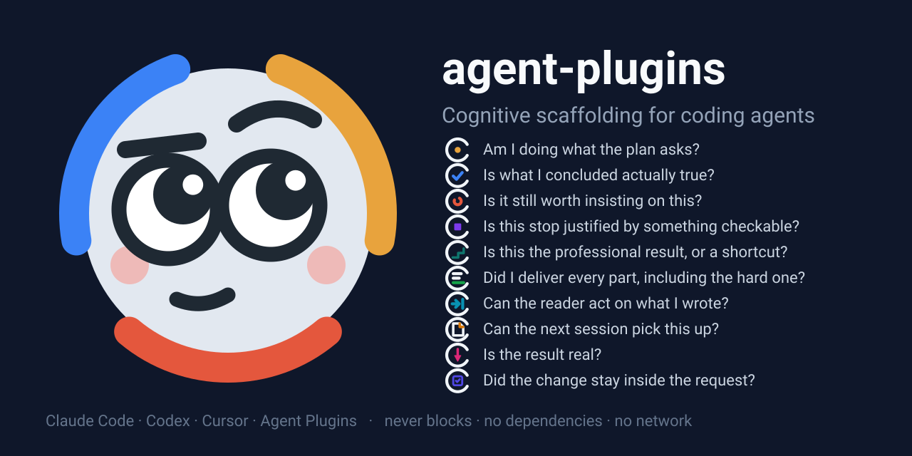

<p align="center">
  
</p>

# agent-plugins

[](https://github.com/3dgiordano/agent-plugins/actions/workflows/ci.yml)
[](LICENSE)

[](https://deepwiki.com/3dgiordano/agent-plugins)

Cognitive scaffolding for coding agents, by [3dgiordano](https://github.com/3dgiordano).

## In one minute

Ten independent plugins for Claude Code, Codex and Cursor. Each one gives a
coding agent one of the self-checks a careful engineer runs in the
background — *am I still on the plan?*, *is this actually verified?*, *is it
worth another try?*, *is that a reason or a phrase?*, *did I do the hard
part?*, *can the reader act on what I wrote?*, *can the next session pick this
up?*, *is the result real?*, *did I review it?*, *did the change stay inside the
request?* — in three parts:

- a **skill**, the discipline: six plugins put its text in context when the
  session starts, the other four ask for it, and every hook line carries the
  block's shape too ([docs/HOW-IT-WORKS.md](docs/HOW-IT-WORKS.md));
- a **hook** that notices a fact the agent is not tracking (the same file
  edited four times, a plan that changed on disk, a ledger with open items)
  and puts it in front of the agent at that moment;
- a **block** the agent fills in reply: fixed fields and named decisions,
  one of which is always the honest way out — *blocked*, *report to the
  user*, *cannot be done as asked, because X*.

They never block by default, have no dependencies, make no network calls, and
send nothing anywhere.

| It is | It is not |
| --- | --- |
| A reminder at the right moment, with the fact that triggered it | A guardrail, a sandbox or a security tool: by default it restricts nothing |
| A fixed answer format that you, a reviewer or another agent can read | A judge of the agent's work, or a monitor that reports to anyone |
| Plain Node hooks and a skill per plugin; install only the ones you want | A framework, or a replacement for your agent, your prompts or your review |
| Simple triggers, tested against real sessions | A way to make the model smarter: same model, more explicit decisions |

> **Where the evidence stands** (2026-09-27, exploratory). On Claude Code,
> runs with a plugin passed **60 of 72** graded tasks (interval 73-90%)
> against **41 of 72** without (45-68%; Sonnet 5, Opus 5, Opus 5.5; n=3 per
> case). By case: progress and executive gained on all three models,
> integrity on two; four cases showed no gain, and one does not measure its
> plugin on Claude. On Cursor (2026-09-23), both Grok models gained strongly
> and Composer 2.5 little. These are not yet a confirmatory result: the
> cases and graders are the plugins' author's, kept when the unaided model
> failed them, not pre-registered and not checked against blind labels
> ([docs/STUDY-PROTOCOL.md](docs/STUDY-PROTOCOL.md) is the plan). Dates,
> versions, costs and limits: [docs/EVIDENCE.md](docs/EVIDENCE.md).

More: [How it works](docs/HOW-IT-WORKS.md) · [Evidence](docs/EVIDENCE.md) ·
[Research](docs/RESEARCH.md) · [FAQ](docs/FAQ.md) · [Security](SECURITY.md)

## What your agent sees — and what you see

A coding agent attends to what is in front of it: the file, the error, the
next step. It does not keep count of how many times it has edited the same
file, does not notice that its reason to stop is a phrase rather than a fact,
does not know that the last session left two things open. These plugins put
exactly those facts in front of it, one line at the moment they matter, and
ask for one named block in return. The line is what the agent sees; the
block is what you see.

**What the agent sees.** Four edits to the same file and three failed test
runs into a turn, a hook adds this to its context:

```
[persistence self-monitoring] you have edited `src/parser.js` 4 times this
turn; `npm test` has failed 3 times this turn. Before the next attempt, write
the [PERSISTENCE CHECK] as a markdown list: Attempts, Hypothesis held, Rival
approach, Proportion, Decision. If nothing about the next attempt is new, say
so to the user instead of trying again. If you do not know what these markers
ask for, load the persistence-self-monitoring skill ("Core Protocol").
```

**What you see.** The agent answers in its next message with the block the
line asked for, and keeps working — or stops, with a reason you can check:

```
[PERSISTENCE CHECK]
- Attempts: src/parser.js edited 4 times; `npm test` red 3 times, same assertion
- Hypothesis held: the tokenizer drops the last field on CRLF input
- Rival approach: normalise line endings before the split, not inside the tokenizer
- Proportion: the request was a one-line fix; this is the third rewrite
- Decision: switch — one try at the normalisation, then report
```

Ten such moments, one plugin each. Every one is anchored to something
countable or on disk, never to "reflect harder":

| What the hook puts in front of the agent | The question | What you read |
|------|--------------|---------------|
| the same file edited 4 times, a command failed 3 times | *is it worth another try?* | `[PERSISTENCE CHECK]` — [persistence](plugins/persistence-self-monitoring/) |
| the first prompt, then every fifth; a plan that changed on disk since it was read | *am I still on the plan?* | `[PLAN CHECK]` — [executive](plugins/executive-self-monitoring/) |
| a claim about to become a fact, a cause or a closure | *observed, or guessed?* | `[EPISTEMIC CLOSE]` — [epistemic](plugins/epistemic-self-monitoring/) |
| a turn that ended on "I'm running out of context" | *a reason, or a phrase?* | `[TERMINATION CHECK]` — [termination](plugins/termination-self-monitoring/) |
| a close with an edited file nobody reviewed since its last change - a document not read, an image not viewed, code not run | *did I review the result against the objective?* | `[ASPIRATION CHECK]` — [aspiration](plugins/aspiration-self-monitoring/) |
| three `TODO`s written this turn | *did I do the hard part?* | `[COVERAGE CHECK]` — [coverage](plugins/coverage-self-monitoring/) |
| the tests just went green | *can the reader act on this?* | `[HANDOFF]` — [handoff](plugins/handoff-self-monitoring/) |
| a session opening on a ledger with open items | *what did the last session leave?* | `.agent/progress.md` — [progress](plugins/progress-self-monitoring/) |
| a `catch` that answers a failed call with a price of its own | *is the result real?* | `[INTEGRITY CHECK]` — [integrity](plugins/integrity-self-monitoring/) |
| edits that changed the code of three public functions the request may not name | *did the change stay inside the request?* | `[HYGIENE CHECK]` — [hygiene](plugins/hygiene-self-monitoring/) |

<details>
<summary>The other lines the agent sees, verbatim</summary>

On the first turn of a session, and every fifth after that:

```
[executive self-monitoring] Checkpoint for long/iterative work: re-open the
artifact that defines it and write the [PLAN CHECK] markdown list - Plan (the
artifact, named), Gate (quoted from it), Drift (none, or what pulls away),
Decision (continue | refocus | revise-plan). If you do not know what these
markers ask for, load the executive-self-monitoring skill. Markers, field
names and status words stay in English, whatever language you write in. Skip
it if this turn is trivial.
```

When a turn ends on "I'm running out of context, let's pick this up in a fresh
session" — a reason the agent has read a thousand times and cannot actually
have — the next prompt opens with:

```
[termination self-monitoring] Your previous turn ended on a state-shaped
reason: a state-shaped reason (budget: "I'm running out of context") with no
[TERMINATION CHECK] block - name the checkable reason or continue. If the work
is unfinished, either write the [TERMINATION CHECK] as a markdown list -
Trigger, Reason (gate-not-run | owner-choice | budget-spent | limit-observed |
none), Evidence, Decision - or pick the work back up now. If you do not know
what these markers ask for, load the termination-self-monitoring skill ("Core
Protocol").
```

When a turn ends on "This is done." right after a change nobody reviewed, the next prompt opens with:

```
[aspiration self-monitoring] Your previous turn closed on a result it called
good enough: 1 edited file not reviewed since the last change - read, view,
run or render it the way the project documents - one refused command says that
command is not allowed, not that nothing runs; a completion claim ("This is
done") with no [ASPIRATION CHECK] block. Review the result the way it will be
used, then write the [ASPIRATION CHECK] as a markdown list - Criterion,
Reviewed, Found, Remainder (meets | defect | unverified | blocked). Stop when
the review finds the criterion met, or say what blocks the review. If you do
not know what these markers ask for, load the aspiration-self-monitoring skill
("Core Protocol").
```

Three `TODO`s into a turn:

```
[coverage self-monitoring] you have written 3 stub / placeholder / TODO
markers this turn (src/stream.js, src/retry.js). Each one is a part of the
request that is not done: implement it now, or close it in the [COVERAGE
CHECK] as blocked or returned, with the reason. If you do not know what these
markers ask for, load the coverage-self-monitoring skill ("Core Protocol").
```

When a session opens — or continues after a compaction — in a project whose
ledger has something in it:

```
[progress self-monitoring] `.agent/progress.md` has 2 open items (1 blocked, 1
returned) and a Next line, updated 2 days ago. Re-open it before substantive
work: it is the record of what the last session left blocked or returned. What
Next names is work for this session, alongside the request: an item whose
block has lifted, do it and remove it; one still blocked or returned stays as
it is. Keep Updated and Next current. If you do not know this ledger's format,
load the progress-self-monitoring skill ("Core Protocol"). Several sessions
can work this ledger at once. Before you start on an open item, claim it: one
line indented under it, `- claim: <token> since <time> alive <time> until
<time> at <worktree or branch> - step: <last step>` - pick a token of your own
- `c` and 7 random hex characters - and keep it for the whole session; times
in UTC ending in Z, read from a tool (`node -e "console.log(new
Date().toISOString())"` runs in any shell), never guessed. Edit lines; never
rewrite the whole file while it holds claims. Then re-read it: the item is
yours only if your line is its one live claim - if there is another, remove
yours and pick another item. Re-read your line before your first change to the
work, and before each write after a pause: gone or replaced, stop - the item
has another owner. Renew it (alive, until, step) as the work moves; set until
for what comes next - a long run gets a later one. A claim more than 5 minutes
past its until is dead: replace that line, by its exact text, with yours,
re-read, and continue from its at and step. Remove your line when you close
the item, leave it blocked or returned, or stop working on it. One claim per
session.
```

When the tests go green after a run of edits — the moment the final message is
about to be written:

```
[handoff self-monitoring] `npm test` passed - this turn looks close to its
end. Close with a [HANDOFF] markdown list, not a fenced code block: Status
(done | waiting | needs-decision | blocked), Situation in the reader's terms, Options
with Default on its own line, Next. Trace detail below it. If you do not know
what these markers ask for, load the handoff-self-monitoring skill ("Core
Protocol").
```

When an edit makes the code answer a failed call with a value of its own:

```
[integrity self-monitoring] `src/rates.js` line 8 answers a failed call with a
value of its own: when the service fails, the user gets a result that looks
real and is not. If the service, the key or the data cannot be had here, the
real result is an error that says so, and "cannot be done as asked, because X"
is a complete answer. If this is what the user asked for, say so in your close
as `- <file or kind>: misread - <why>`. Write the [INTEGRITY CHECK] as a
markdown list: Result (real | shortcut | blocked), Route, Outside the task,
Told the user. If you do not know what these markers ask for, load the
integrity-self-monitoring skill. Markers, field names and status words stay in
English, whatever language you write in.
```

When the edits have changed the code of two or more public functions, the agent
hears how many and where - the path and the lines, never the names:

```
[hygiene self-monitoring] Since the session started, your edits changed the
code of 3 public functions (src/headers.js lines 17, 30, 35). The request may
name some of them; each one it does not name is outside it - put it back, or
offer it to the owner with what it would change for callers. Close with the
[HYGIENE CHECK] markdown list: Request names, Change reaches, Outside,
Decision (keep | revert-extra | ask-owner). If you do not know what these
markers ask for, load the hygiene-self-monitoring skill ("Core Protocol").
```

The epistemic line arrives when a claim is about to be closed on, and asks for
the claim with its evidence, its falsifier and its scope — so you can tell
*observed* from *guessed* without asking.

</details>

## Which one first?

Pick by the problem you see most. They install independently; add more later.

| If your agent... | Try |
| --- | --- |
| keeps retrying the same fix | [persistence](plugins/persistence-self-monitoring/) |
| stops early with "running out of context" or "let's continue later" | [termination](plugins/termination-self-monitoring/) |
| calls the work done without running or viewing the result after its last change | [aspiration](plugins/aspiration-self-monitoring/) |
| wanders off the plan or the spec, or works from an old version of it | [executive](plugins/executive-self-monitoring/) |
| states causes or facts it did not check | [epistemic](plugins/epistemic-self-monitoring/) |
| leaves TODOs or skips the hard part | [coverage](plugins/coverage-self-monitoring/) |
| ends with a wall of text you cannot act on | [handoff](plugins/handoff-self-monitoring/) |
| loses track of open work between sessions | [progress](plugins/progress-self-monitoring/) |
| ships mocks or fallbacks that look like real results | [integrity](plugins/integrity-self-monitoring/) |
| fixes the bug and also changes a function you did not mention, "for consistency" | [hygiene](plugins/hygiene-self-monitoring/) |

## Quick start

Pick your host. It is the same plugin folder on each; only the install
command differs.

**Claude Code**

```
claude plugin marketplace add 3dgiordano/agent-plugins
claude plugin install persistence-self-monitoring@3dgiordano-agent-plugins
```

**Codex**

```
codex plugin marketplace add 3dgiordano/agent-plugins
codex plugin add persistence-self-monitoring@3dgiordano-agent-plugins
```

then `/hooks` once in a `codex` session to trust the plugin's hooks.

**Cursor** — Dashboard → Plugins → Add Marketplace → *Import from Repo*,
`3dgiordano/agent-plugins`, then install from Customize → Plugins.

Swap in any of the other nine, or install all ten: [Install](#install) has
the full lists and the per-host notes.

## Plugins

| Plugin | Status | What it does |
|--------|--------|--------------|
| [executive-self-monitoring](plugins/executive-self-monitoring/) | available | Plan-anchored drift self-check: periodically nudges the agent to re-read the active plan/gate instead of drifting, and says when a document it read has changed on disk since. Not a blocker. |
| [epistemic-self-monitoring](plugins/epistemic-self-monitoring/) | available | Observation vs. conjecture discipline: claims carry their evidence and a named falsifier; only verified claims become facts or closures. Non-blocking by default, opt-in strict gate. |
| [persistence-self-monitoring](plugins/persistence-self-monitoring/) | available | Persist-or-quit signal: counts repeated attempts on the same file, command or error and effort since the user last spoke; nudges only when a threshold is crossed. Never blocks. |
| [termination-self-monitoring](plugins/termination-self-monitoring/) | available | Checkable-reason discipline: a state-shaped reason to stop, defer or narrow ("running out of context", "long session", "not confident enough", "given the complexity", a run of apologies) is replaced by a checkable one or dropped, and the work continues. Non-blocking by default, opt-in strict gate. |
| [aspiration-self-monitoring](plugins/aspiration-self-monitoring/) | new (0.1) | Review-before-you-close discipline: a close with an edited file nobody reviewed in its medium - read, viewed, run, rendered or played - is named, and the result is compared, point by point, with a source the agent did not write - the original, the specification, the real input, the owner's words. Meets only when that comparison shows it; a difference still there is a defect, a source out of reach is unverified. Non-blocking by default, opt-in strict gate. |
| [coverage-self-monitoring](plugins/coverage-self-monitoring/) | available | Parts-ledger discipline: the parts of a request, hardest first, each closed as done, blocked with an observed reason, or returned to the owner. Counts stubs and TODOs written per turn; flags deferred work with no closing ledger. Never blocks. |
| [handoff-self-monitoring](plugins/handoff-self-monitoring/) | available | Structured-handoff discipline: the final message closes with a `[HANDOFF]` block modelled on SBAR / I-PASS — status, situation in the reader's terms, options with a default, one next action. Injects the format on the first green gate or commit of the turn; flags a decision named but not handed off. Non-blocking by default, opt-in strict gate. |
| [integrity-self-monitoring](plugins/integrity-self-monitoring/) | available | Real-result discipline: when a service, a key or consistent tests are missing, the result is an error that says so, not a fallback that looks done. Reads each edit to product code for made-up data where a service was asked for, or code that reads its caller, and each shell command for a change to the machine or a server started; each finding is said once, with what it means for you. Nothing on the prompt. Never blocks. |
| [progress-self-monitoring](plugins/progress-self-monitoring/) | available | Cross-session ledger discipline: what a session leaves `blocked` or `returned`, with the reason, and the next action, kept in `.agent/progress.md` and re-opened before the next session works. Announces the ledger's open items when a session opens or continues after a compaction; notices a turn that edited files and left it untouched. Never blocks. |
| [hygiene-self-monitoring](plugins/hygiene-self-monitoring/) | new (0.1) | Change-scope discipline: the public functions a change reaches - an exported function, a helper other callers use, a sibling fixed for consistency - are recorded file by file, and the close names what the request does not and puts it back or offers it to the owner. Size is not the measure. Non-blocking by default, opt-in strict gate. |

Each plugin folder has its own README with design notes, host differences,
debugging tips and the research it draws on. What each host runs is in
[How it works](docs/HOW-IT-WORKS.md#where-it-runs-and-where-it-is-weaker).

## What the hooks do on your machine

You are installing scripts that run on every prompt and every tool call, so
here is exactly what they are:

- **Plain Node, no dependencies.** Each hook is one file you can read in a
  minute; `node --check` is the whole build.
- **No network, no telemetry.** Nothing leaves your machine. Ever.
- **Nothing persisted by default.** Per-session counters live in the OS temp
  dir and are the only state. Debug logs exist but are **off** unless you set
  an env var, and then they are written inside your project, size-bounded.
  Three plugins **read** a file in your project, and none repeats its
  text: progress reads one fixed file (`.agent/progress.md`) if you keep one —
  its mtime and counts by kind — integrity reads the file an edit just
  wrote, to name the file, the line and the shape it found, and executive, on
  Claude Code, reads only the modification time of the documents the agent
  read, to say that one changed since. No hook writes any of them. What a hook
  reads never becomes what it says: [SECURITY.md](SECURITY.md).
- **Never blocking by default.** Every hook fails silent: an error in a hook
  lets the prompt, tool call or stop proceed. Five opt-in gates exist —
  `EPIMON_STRICT` (an incomplete closure block), `TERMMON_STRICT` (a
  state-shaped reason to stop with no checkable one), `HANDMON_STRICT` (a
  decision named with no handoff), `ASPMON_STRICT` (a close after a change
  nobody reviewed) and `HYGMON_STRICT` (a change that reaches what the
  request does not name) — and each blocks once, never in a loop. The other
  five plugins have no blocking mode at all.
- **Visible when it finds something.** A finding - a close without its
  block, a counter over its threshold, open items in the ledger - also shows
  you one line in the transcript (Claude Code and Codex; Cursor has no field
  for it). The ledger's line comes with your first message, not when the
  session opens: the desktop app does not show a notice sent at session
  start. Off per plugin with `*_NOTICE=0`.
- **Tested as the host runs them.** CI drives every adapter with the JSON its
  host sends, on Ubuntu and Windows, Node 18/20/22.

## Research, not only software

The collection is also an open experiment: can small, event-triggered
scaffolds change what a coding agent actually does? Every claim is measured
on an outcome bench that scores the workspace, never the block, in isolated
and audited runs, and every result carries its date, versions and sample
size.

- [docs/EVIDENCE.md](docs/EVIDENCE.md): what is measured, what is not, and
  where a plugin made things worse.
- [docs/STUDY-PROTOCOL.md](docs/STUDY-PROTOCOL.md): what a confirmatory
  study needs before a number is reported as an effect - pre-registration,
  frozen and validated graders, a placebo arm, power, archived data.
- [docs/RESEARCH.md](docs/RESEARCH.md): the hypotheses, the method, the
  threats to validity, the open questions, and the work each design choice
  draws on — as inspiration or as evidence that the problem exists, never as
  proof that the plugins work.
- [bench/INTEGRITY.md](bench/INTEGRITY.md): how agents under a test they
  could not pass went after the answer key, changed the machine and planted a
  test-only backdoor, and what closed each route ([bench/GUARDS.md](bench/GUARDS.md)).

The cases are written by the plugins' author, which is the project's largest
limitation. If you work on agents or evaluation, a case, a corpus line from a
real session or a review is the most useful contribution you can make
([docs/RESEARCH.md](docs/RESEARCH.md#contributing)). To cite the project, use
GitHub's "Cite this repository" ([CITATION.cff](CITATION.cff)).

## Requirements

- **`node` on the host's PATH, Node 18 or later.** Every hook is launched as
  `node <script>`, by Claude Code, Codex or Cursor. The hooks use Node's
  built-ins only (`fs`, `os`, `path`), with no packages and no network.
- **A host that runs plugin hooks**: Claude Code, Codex (after trusting the
  hooks once with `/hooks`), or Cursor. On Cursor headless (`agent -p`),
  hooks run only when the process was not started from Git Bash. Any other
  Agent Skills or Agent Plugins client gets the skills and no hooks.
- Nothing else: no build step, no install script, no service.

What this repository's own test pipeline, evals and bench need is in
[CONTRIBUTING.md](CONTRIBUTING.md#what-each-layer-needs).

## Install

### Claude Code

Register this repo as a marketplace, then install the plugin from it. Works
from the `claude plugin` CLI or the interactive `/plugin` command in a session.

```
claude plugin marketplace add 3dgiordano/agent-plugins
claude plugin install executive-self-monitoring@3dgiordano-agent-plugins
claude plugin install epistemic-self-monitoring@3dgiordano-agent-plugins
claude plugin install persistence-self-monitoring@3dgiordano-agent-plugins
claude plugin install termination-self-monitoring@3dgiordano-agent-plugins
claude plugin install aspiration-self-monitoring@3dgiordano-agent-plugins
claude plugin install coverage-self-monitoring@3dgiordano-agent-plugins
claude plugin install handoff-self-monitoring@3dgiordano-agent-plugins
claude plugin install progress-self-monitoring@3dgiordano-agent-plugins
claude plugin install integrity-self-monitoring@3dgiordano-agent-plugins
claude plugin install hygiene-self-monitoring@3dgiordano-agent-plugins
```

```
/plugin marketplace add 3dgiordano/agent-plugins
/plugin install executive-self-monitoring@3dgiordano-agent-plugins
/plugin install epistemic-self-monitoring@3dgiordano-agent-plugins
/plugin install persistence-self-monitoring@3dgiordano-agent-plugins
/plugin install termination-self-monitoring@3dgiordano-agent-plugins
/plugin install aspiration-self-monitoring@3dgiordano-agent-plugins
/plugin install coverage-self-monitoring@3dgiordano-agent-plugins
/plugin install handoff-self-monitoring@3dgiordano-agent-plugins
/plugin install progress-self-monitoring@3dgiordano-agent-plugins
/plugin install integrity-self-monitoring@3dgiordano-agent-plugins
/plugin install hygiene-self-monitoring@3dgiordano-agent-plugins
```

Enabling the plugin makes the skill available **and** auto-registers its hooks —
no manual `settings.json` edit, no per-project file copying.

Both commands accept `--scope <user|project|local>`:

| Scope | Written to | Applies to |
|-------|-----------|------------|
| `user` *(default)* | your global `~/.claude` config | you, in every project |
| `project` | the project's `.claude/settings.json` (git-tracked) | everyone who clones the repo |
| `local` | the project's `.claude/settings.local.json` (gitignored) | just you, just this project |

> If a project already has a hand-wired copy of a plugin's hook (in its own
> `.claude/hooks/` + `settings.json`), remove that wiring after installing the
> plugin — otherwise it fires twice.

### Codex

Register this repo as a marketplace, install the plugin, then open `/hooks`
once in an interactive `codex` session and trust the plugin's hooks. Codex
skips a plugin's hooks until they are reviewed, and remembers the review per
hook definition — a plugin update that changes a hook asks again.

```
codex plugin marketplace add 3dgiordano/agent-plugins
codex plugin add executive-self-monitoring@3dgiordano-agent-plugins
codex plugin add epistemic-self-monitoring@3dgiordano-agent-plugins
codex plugin add persistence-self-monitoring@3dgiordano-agent-plugins
codex plugin add termination-self-monitoring@3dgiordano-agent-plugins
codex plugin add aspiration-self-monitoring@3dgiordano-agent-plugins
codex plugin add coverage-self-monitoring@3dgiordano-agent-plugins
codex plugin add handoff-self-monitoring@3dgiordano-agent-plugins
codex plugin add progress-self-monitoring@3dgiordano-agent-plugins
codex plugin add integrity-self-monitoring@3dgiordano-agent-plugins
codex plugin add hygiene-self-monitoring@3dgiordano-agent-plugins
```

The skill loads on install; the hooks run after `/hooks`. For scripted runs
(`codex exec`) that already vet their hook sources, `--dangerously-bypass-hook-trust`
runs them without the review. Verified on codex-cli 0.155.1 on Windows.

### Cursor

Add this repo as a marketplace (Dashboard → Plugins → Add Marketplace → *Import
from Repo*, `3dgiordano/agent-plugins`), then install the plugin from
**Customize → Plugins**. Cursor loads the shared skill directly and registers the
`sessionStart` hook from `cursor/hooks.json`. Restart Cursor after installing.

### Local development

To test changes from a checkout instead of GitHub, register the folder path as
the marketplace (`claude plugin marketplace add /path/to/agent-plugins`, or
`codex plugin marketplace add /path/to/agent-plugins`) and install with the
same `<plugin>@3dgiordano-agent-plugins` name.

## Repository layout

```
.claude-plugin/marketplace.json   # Claude Code marketplace index
.cursor-plugin/marketplace.json   # Cursor marketplace index (same plugins)
.agents/plugins/marketplace.json  # Codex marketplace index (same plugins)
plugins/<name>/
  .plugin/plugin.json             # Agent Plugins portable manifest (not at the root: see How it works)
  .claude-plugin/plugin.json      # Claude Code manifest
  .codex-plugin/plugin.json       # Codex manifest (points at skills/ and hooks/hooks.json)
  .cursor-plugin/plugin.json      # Cursor manifest (points hooks at cursor/)
  skills/<name>/SKILL.md          # shared core - the single source of truth
  hooks/                          # Claude Code + Codex hook adapter
  cursor/                         # Cursor hook adapter
  lib/                            # code shared by the adapters
docs/                             # how it works, evidence, research, FAQ
bench/                            # the outcome bench: cases, graders, guards, reports
evals/                            # detector corpora and the behavioural-eval protocol
scripts/                          # tests, runners, audit, report
CITATION.cff                      # how to cite the project
```

## Contributing

Proposals, bug reports and pull requests are welcome, and so are cases,
corpus lines and reviews from people who work on agents or evaluation. What
fits the collection (one function per plugin, anchored to an artifact or an
objective count, never blocking by default, host-neutral skill, named for what
it monitors), how to add or change a plugin, how to contribute to the bench,
and how releases are cut are all in [CONTRIBUTING.md](CONTRIBUTING.md).
Changes are tracked in [CHANGELOG.md](CHANGELOG.md).

## Development

No dependencies.

```
node scripts/test.js            # structure checks + every hook adapter driven as its host would
node scripts/version.js --check # each plugin's four manifests agree on the version
node scripts/calibrate.js <dir> # what-if nudge rates from the opt-in logs of real sessions
```

The thresholds (4 edits, 3 failures, 30 tool calls, 3 stubs, 3 parts, 3
apologies, 6 closing lines) are reasoned, not measured. To tune them: set the
`*_LOG` env vars in a project you actually work in, work for a while, then run
`calibrate.js` on that project. It prints, per signal, the distribution of the
per-turn measurement and the share of turns that would have been nudged at
each candidate threshold — the number is the signal only if it stays rare.

CI runs the suite on Ubuntu and Windows across Node 18/20/22 for every push
and pull request. The tests drive each hook script with the JSON its host
sends and inspect stdout, stderr and exit codes, so a change that breaks a
Claude Code, Codex or Cursor contract fails before it ships.

## License

[Apache-2.0](LICENSE)
